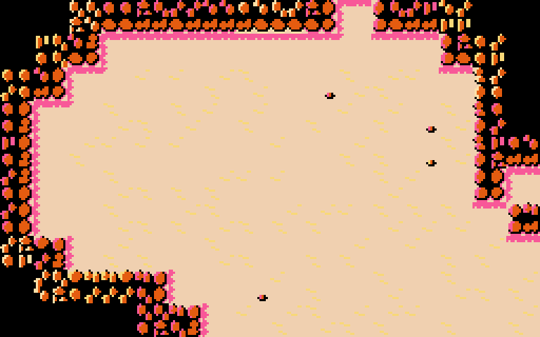

# ファミコン向けダンジョンタイルセット（試作）

作成日: 2026-09-24

更新履歴:

- 第 2 版（2026-09-24）: 参考画像を受けて描き直した。
- 第 3 版（2026-09-24）: 8×8 のチップを共通化した。輪郭をやめ、壁の外を
  闇に溶けこませた。レンガの壁と敷石のバリエーションを加えた。
- 第 4 版（2026-09-24）: パレット（属性）の振りかたで同じチップを描き分ける
  ようにした。岩のチップを 21 枚に組みなおした。

`docs/famicom_graphics_inventory.md` の第 2 節（ダンジョンのタイル）と
第 8 節（全体マップ）を、実際に絵にした試作。

## 方針

### 手本（参考画像: 初代ゼルダの砂地と岩山）

1. **同じ砂地でも模様を変える**（さざ波・敷石・小石）。
2. **光は左上から**。左と上の縁は輪郭を描かずに床につなぎ、右と下の縁
   だけ黒い影で締める。
3. **岩山の奥は黒に溶ける**。
4. **岩は黒と茶の 2 色**。参考画像を 8×8 に分けて調べると、岩山の 54 種類
   のタイルは黒と茶を共通にし、3 色目だけが砂・ピンク・薄いピンクと
   入れかわっていた（黒と茶の形だけで数えると 42 種類）。

### パレットで同じチップを描き分ける

ファミコンのチップが持つのは色番号（0〜3）だけで、実際の色は 16×16 ごとの
属性で選ぶパレットで決まる。そこで、地形のパレットを次のようにそろえた。

| パレット | 0 番 | 1 番 | 2 番 | 3 番 |
|---|---|---|---|---|
| P0 影側 | 床 | 黒 | 岩 | **影（ピンク）** |
| P1 光側 | 床 | 黒 | 岩 | **明かり（黄）** |
| P2 淡色 | 床 | 黒 | 岩 | **淡いクリーム** |
| P3 生き物 | 床 | 黒 | 緑 | 明るい緑 |

P0・P1・P2 は 0〜2 番が同じで、3 番だけが違う。チップの 3 番に描いた点は、
置いたマスの属性によって次のように変わる。

- **P0**: 岩の下や右の床に落ちる**ピンクの影**
- **P1**: 光の当たった岩の縁や**黄色の敷石**
- **P2**: **淡い光**（参考画像の薄いピンクにあたる色）

1 枚のチップが最大 3 通りの色に化けるので、少ない枚数で見た目の種類を
増やせる。

### チップの共通化

16×16 のマスは、チップ 4 枚の組み合わせで作る。

- **壁**は、どの辺が床に面しているかで 1/4 ごとにチップを選ぶ（1/4 に効く
  のはその角をはさむ 2 辺だけ）。岩はさらに、1/4 ごとに 3 ビットずつ
  位置から模様を選ぶ。
- **床**は、敷石とさざ波のチップを並べかえる。
- **扉・階段・罠**は、同じチップを 2 回・4 回と繰りかえす。
- **ルーンと守りのルーン**は、同じ 4 枚をパレット違いで使う。

### 背景色を床の色にする

全パレット共通の背景色（0 番）は床の色で、黒は各パレットの 1 番に持つ。
岩の縁を床に食いこませることと、壁の奥・未探索の闇を同じ黒で塗って
溶けこませることが両立する。

## 岩のチップ 21 枚と参考画像の比較

参考画像の岩山を 16×16 のマス単位に読みとり、同じ配置に岩のチップを
並べた。左上と左下の一部は石英の鉱脈（同じチップを P2 で）にしている。

| | 参考画像 | 試作（第 4 版） |
|---|---:|---:|
| 岩山の 8×8 の場所 | 195 | 192 |
| CHR のタイル（チップ） | 54 | **19**（21 枚のうち、この配置で使ったもの） |
| 色まで含めた 8×8 の見た目の種類 | 54 | **36** |
| 16×16 の見た目の種類 | 34（岩だけのブロック 34 個すべて別） | 38（岩のマス 48 個のうち） |

- **16×16 の種類数は参考画像と同程度**。チップを 1/4 ごとに位置から
  選び、属性も位置で振るので、同じ組み合わせが並びにくい。
- **8×8 の見た目の種類は 36 で、参考画像の 2/3**。上限を決めているのは
  パレットを選ぶ規則で、下と右が床に面した岩は影をピンクにするため P0
  しか使えない。いまの規則のまま出せるのは 41 種類ほど。
- **形の違いはまだ及ばない**。参考画像の岩は縦長の指のような塊で、
  奥の黒の中まで大きさがまちまちに続く。試作の岩は丸い塊が縁に沿って
  並ぶので、規則正しく見える。チップの形を描きこめば、枚数を増やさずに
  近づけられる余地がある。

岩のチップの内訳:

| 番号 | チップ | 数 |
|---|---|---:|
| 01 | `black`（奥・闇） | 1 |
| 02–07 | `rock_in_{a..f}`（奥の段の岩。3 番は岩の頭の明かり） | 6 |
| 08–0F | `rock_{top,left,bottom,right}_{a,b}`（床に面した縁） | 8 |
| 10–13 | `rock_c{tl,tr,bl,br}`（2 辺が床に面した角） | 4 |
| 14–15 | `gem_{top,bottom}`（宝を含む鉱脈の縁） | 2 |

番号は `dungeon_bg.chr` のタイル番号（16 進）。

## 画面のモック

- **部屋のまわり**: レンガの壁（P2）。
- **通路のまわり**: 岩の壁。1/4 ごとに模様を選び、マスごとに P0/P1/P2 を
  振る。
- **壁の奥・未探索**: 黒。
- **部屋の床**: 敷石（P1 で黄）。壁ぎわの影が落ちたマスは P0 になり、
  敷石を置かずピンクの影だけにする。
- **通路の床**: 砂（P1 のさざ波）。

## チップ一覧

チップはパレットを P1 にして並べている。

| 番号（16 進） | チップ | 使うパレット | 使いみち |
|---|---|---|---|
| 00 | `blank` | どれでも | 床の色だけ |
| 01–15 | 岩（上の表） | P0・P1・P2 | 岩の壁・石英の鉱脈・宝を含む鉱脈 |
| 16–1F | `brick_*` | P2 | レンガの壁（正面 2＋ひび、角 4、縁 3） |
| 20–21 | `ripple_{a,b}` | P1 | 砂のさざ波 |
| 22–26 | `tile_{big,small,crack,worn,brick}` | P1 | 敷石 |
| 27–2A | `shadow_{top,left,tl,dot}` | P0 | 壁から床に落ちる影 |
| 2B–2D | `boulder_{a,b}` `pebble` | P0・P1 | 瓦礫・落石・小石 |
| 2E–31 | `door_{l,r}` `door_open_{l,r}` | P1 | 扉（縦横で同じ絵） |
| 32–35 | `steps_*` | P1 | 階段 |
| 36–39 | `pit_*` | P0 | 落とし穴 |
| 3A–3D | `ring_*` | P0・P1 | 魔法陣（岩の色の輪。星が P0 でピンク、P1 で黄） |
| 3E–42 | `planks` `grate` `plate` `scorch` `acid` | P1・P1・P1・P0・P3 | 罠 |

## 組みたての例

上の行から順に並べている。

1. 岩の壁（床に面した辺の 16 通り）
2. レンガの壁（同じ 16 通り）
3. 奥の岩（模様 4 通り）と縁の岩を、P0・P1・P2 で描き分けた例
4. 石英の鉱脈と宝を含む鉱脈
5. 床: 砂・小石（P0/P1）・敷石
6. 影の落ちた床と、モンスター・アイテムの見本
7. 闇・扉・階段・瓦礫・罠・守りのルーン

## 組みたての規則

### 壁

1. **辺の判定**: マスの上下左右それぞれについて、隣が「壁でも未探索でも
   ない」ならその辺が床に面しているとする。
2. **1/4 ごとのチップ**: その角をはさむ 2 辺の状態で選ぶ。

   | 1/4 | 見る辺 | どちらも無し | 左右の辺だけ | 上下の辺だけ | 両方 |
   |---|---|---|---|---|---|
   | 左上 | 上・左 | 奥の岩 / 黒 | 左の縁 | 上の縁 | 左上の角 |
   | 右上 | 上・右 | 奥の岩 / 黒 | 右の縁 | 上の縁 | 右上の角 |
   | 左下 | 下・左 | 奥の岩 / 黒 | 左の縁 | 下の縁 | 左下の角 |
   | 右下 | 下・右 | 奥の岩 / 黒 | 右の縁 | 下の縁 | 右下の角 |

   「どちらも無し」は、マスがどこかで床に接していれば（斜めを含む）奥の
   岩、どこにも接していなければ黒。黒のマスが闇に溶ける。
3. **模様**: 位置から計算した値の 3 ビットずつを 1/4 ごとに使い、奥の岩
   6 種と縁の A/B を選ぶ。
4. **属性（パレット）**:
   - 岩: 下か右が床なら P0（床に落ちる影がピンク）。それ以外は位置で
     P0・P1・P2 を振る。
   - レンガと石英: P2。
5. **種類**: 8 近傍に部屋の床があればレンガ、なければ岩。溶岩の鉱脈は
   原典の既定の表示と同じく花崗岩と見分けない。宝を含む鉱脈は、上下の
   縁の一部を宝のチップに差しかえる。

この選びかたは `dungeon_metatiles.inc` の `wall_<種類>` に表として出して
ある（1/4 × 状態 4 × 模様 8 = 32 バイト / 種類）。

### 床

- **模様**: 位置から選ぶ。部屋は敷石 7 通り、通路は砂 5 通り、影の無い
  通路には時々小石。
- **影**: 上が壁なら左上と右上の 1/4 を、左が壁なら左上と左下を影の
  チップに差しかえ、マスを P0 にする。P0 では敷石やさざ波の 3 番もピンク
  になってしまうので、影のマスでは模様を無地にする。

### そのほか

- **扉**は縦の壁でも横の壁でも同じ絵。
- **隠し扉**は、見つかるまでは壁と同じ選びかたで描く。

## 深さごとの配色

絵（CHR）は同じまま、パレットだけを入れかえる。

| 深さ | 名前 | 床（0 番） | 岩（2 番） | 影（P0 の 3 番） | 明かり（P1 の 3 番） |
|---|---|---|---|---|---|
| B1–10 | 砂岩（参考画像の配色） | `$36` | `$17` | `$25` | `$38` |
| B11–20 | 石灰岩 | `$10` | `$18` | `$00` | `$37` |
| B21–30 | 苔 | `$3B` | `$1A` | `$2B` | `$3A` |
| B31–40 | 氷 | `$31` | `$12` | `$21` | `$30` |
| B41– | 火山 | `$06` | `$10` | `$07` | `$17` |

P2 の 3 番はどの深さでも `$37`（淡いクリーム）、1 番は `$0F`（黒）。

## 全体マップ

1 タイル（8×8）＝ ダンジョンの 4×4 マス。見本は 96×80 マスで、全体
マップは 24×20 タイル。

- 通路は 16 枚、部屋は 16 枚、枠は 6 枚。
- 階段と現在地はスプライトで出す。
- 全体マップの画面は、黒地の別のパレット一式を使う。

## タイルの枚数

| 群 | 8×8 の枚数 |
|---|---:|
| 地形のチップ | **67**（うち岩 21） |
| 見本（ゼリー・金貨・薬瓶） | 12 |
| 全体マップ | 37 |
| 文字（モックに要る分だけ） | 20 |
| 合計 | 136 / 256 |

## 気になっている点

- **P2 を淡色にしたため、灰色が無くなった**。レンガの壁と薬瓶は岩の色に
  なった。灰色の石の部屋にしたいなら、P2 を灰にして岩の描き分けを 2 通り
  （P0・P1）に戻すことになる。
- **P0 のマスでは、岩の明かり（3 番）もピンクになる**。奥の岩の頭が
  ピンクに光って見える所がある。
- **守りのルーン**（P1）の星は黄色なので、敷石の上では見えにくい。
- **プレイヤー**はスプライトなので黒の輪郭を残している。

## ファイル

| ファイル | 中身 |
|---|---|
| `scripts/famicom/make_dungeon_tiles.py` | 絵の元と書き出し。外部ライブラリは使わない |
| `assets/famicom/dungeon_bg.chr` | NES の 2bpp CHR |
| `assets/famicom/dungeon_metatiles.inc` | ca65 の表: チップ番号、壁の 1/4 ごとの選びかた、床の模様、そのほかのメタタイル |
| `assets/famicom/dungeon_chips.png` | 地形のチップ一覧 |
| `assets/famicom/dungeon_tiles.png` | 組みたての例 |
| `assets/famicom/rock_demo.png` | 参考画像の岩山と同じ配置で並べた岩 |
| `assets/famicom/dungeon_depths.png` | 深さごとの配色 |
| `assets/famicom/mock_screen.png` | ダンジョン画面のモック |
| `assets/famicom/minimap_tiles.png` / `mock_minimap.png` | 全体マップ |

作り直すときは `python3 scripts/famicom/make_dungeon_tiles.py`。数えた
結果（岩の種類数など）も標準出力に出る。
