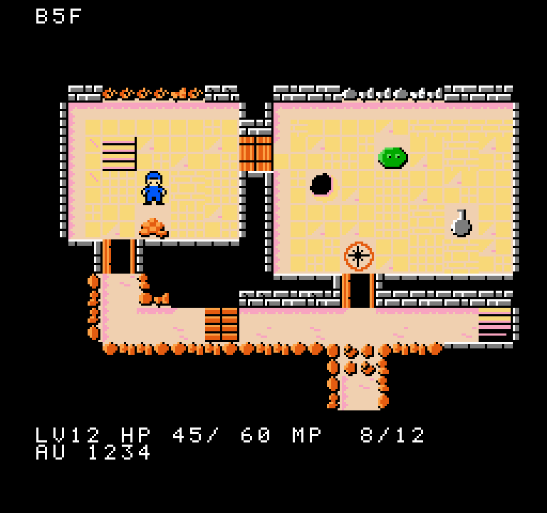
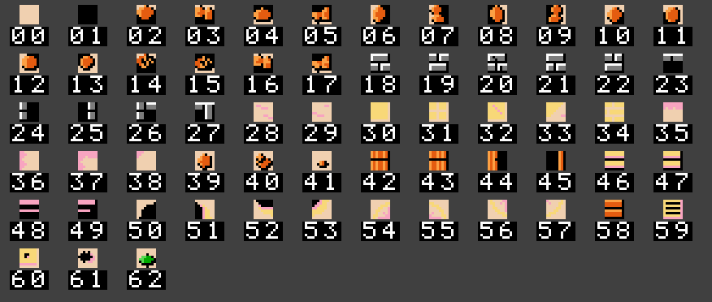
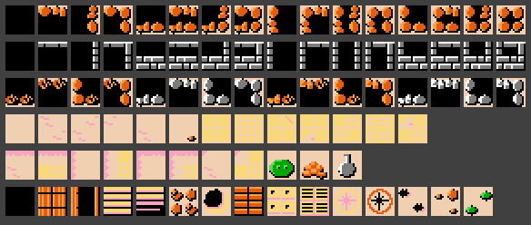
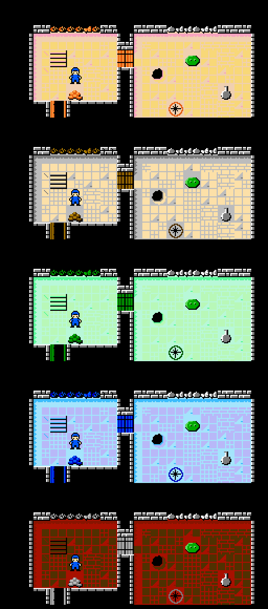
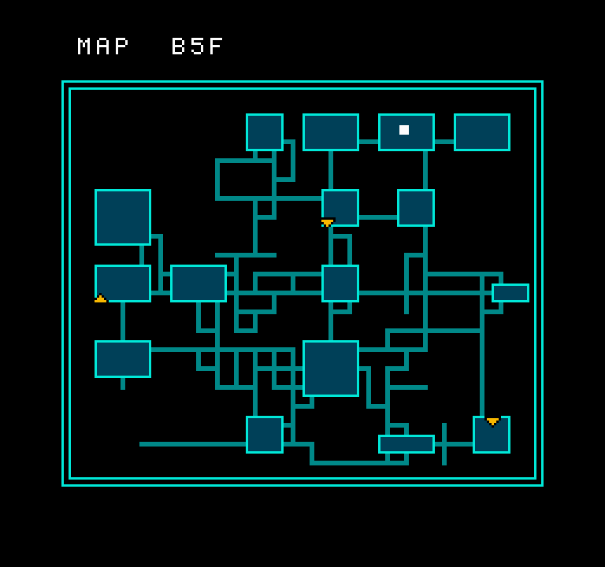
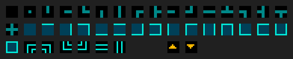

# ファミコン向けダンジョンタイルセット（試作）

作成日: 2026-09-24

更新履歴:

- 第 2 版（2026-09-24）: 参考画像を受けて描き直した。
- 第 3 版（2026-09-24）: 8×8 のチップを共通化した。輪郭をやめ、壁の外を
  闇に溶けこませた。レンガの壁と敷石のバリエーションを加えた。

`docs/famicom_graphics_inventory.md` の第 2 節（ダンジョンのタイル）と
第 8 節（全体マップ）を、実際に絵にした試作。

## 方針

### 手本（参考画像: 初代ゼルダの砂地と岩山）

1. **同じ砂地でも模様を変える**（さざ波・敷石・小石）。
2. **光は左上から**。左と上の縁は輪郭を描かずに明るい筋で床につなぎ、
   右と下の縁だけ黒い影を強める。
3. **岩山の奥は黒に溶ける**。岩の塊は砂地に面した縁にだけ並び、その
   奥は真っ黒になる。

### チップを共通化して組みかえる

地形は 8×8 の**チップ 63 枚**だけでできている（第 2 版は 190 枚）。
16×16 のマスは、チップ 4 枚の組み合わせで作る。

- **壁**は、どの辺が床に面しているかの 16 通りを、1/4 ごとにチップを
  選んで組む。1/4 に効くのはその角をはさむ 2 辺だけ。
- **床**は、同じ敷石・さざ波のチップを並べかえて模様を増やす。
- **扉・階段・罠**は、同じチップを 2 回・4 回と繰りかえして 16×16 にする。
- **ルーンと守りのルーン**は、同じ 4 枚をパレットだけ替えて使う。

### 背景色を床の色にする

全パレット共通の背景色（0 番）は床の色。黒は各パレットに 1 色ずつ
持つ。これで次の 2 つが両立する。

- 岩のチップの中に床の色を入れて、縁を床に食いこませる。
- 壁の奥と未探索の闇を同じ黒で塗って、つなぎ目なく溶けこませる。

## 画面のモック

- **壁の種類**: 部屋のまわりの壁はレンガ（灰と白）、通路のまわりの壁は
  岩（茶）。
- **壁の奥**: 床に面していない壁と未探索のマスは黒で、画面の外の闇と
  区別がつかない。
- **床の模様**: 部屋の床は敷石、通路の床は砂（さざ波と小石）。
- **影**: 壁の下と右の床にはピンクの影が落ちる。

## チップ一覧

番号は `dungeon_bg.chr` のタイル番号。

| 番号 | チップ | パレット | 使いみち |
|---|---|---|---|
| 00 | `blank` | どれでも | 床の色だけ。床の 1/4 の多く |
| 01 | `black` | P1・P2 | 黒だけ。壁の奥・未探索の闇 |
| 02–09 | `rock_{top,bottom,left,right}_{a,b}` | P1（石英は P2） | 床に面した辺の岩。A と B を交互に使う |
| 10–13 | `rock_c{tl,tr,bl,br}` | P1 | 2 辺が床に面した角の岩 |
| 14–15 | `magma_top` `magma_bottom` | P1 | 溶岩の鉱脈（暗い岩に光る割れ目） |
| 16–17 | `treasure_top` `treasure_bottom` | P1・P2 | 宝を含む鉱脈（金の粒） |
| 18–22 | `brick_face_{a,b,crack}` `brick_c{bl,br}` | P2 | レンガの正面（床に面した下の辺）。目地の位置 2 通り＋ひび |
| 23–27 | `brick_cap_{top,left,right}` `brick_c{tl,tr}` | P2 | レンガの壁の上端・横の縁 |
| 28–29 | `ripple_{a,b}` | P0 | 砂のさざ波 |
| 30–34 | `tile_{big,small,crack,worn,brick}` | P0 | 敷石: 大・小 4 枚・ひび・欠け・レンガ敷き |
| 35–38 | `shadow_{top,left,tl,dot}` | P0 | 壁から床に落ちる影 |
| 39–41 | `boulder_{a,b}` `pebble` | P1 | 岩のかけら: 瓦礫・落石・小石 |
| 42–45 | `door_{l,r}` `door_open_{l,r}` | P1 | 扉（上下に 2 回並べる） |
| 46–49 | `steps_{l,r}` `steps_dark_{l,r}` | P0 | 階段 |
| 50–53 | `pit_{tl,tr,bl,br}` | P0 | 落とし穴 |
| 54–57 | `ring_{tl,tr,bl,br}` | P0・P1 | 魔法陣（ルーン・守りのルーン） |
| 58–62 | `planks` `grate` `plate` `scorch` `acid` | P1・P0・P0・P0・P3 | 4 回または 2 回並べて使う罠 |

## 組みたての例

上の行から順に並べている。

1. **岩の壁**: 床に面した辺の 16 通り（0 = どこも面していない = 黒、
   1 = 上、2 = 右、4 = 下、8 = 左の和）
2. **レンガの壁**: 同じ 16 通り
3. **鉱脈**: 溶岩・石英・溶岩＋宝・石英＋宝を、それぞれ 4 通りの面しかたで
4. **床**: 砂 5 通り、小石、敷石 7 通り
5. **影の落ちた床**（通路・部屋 × 上・左・上と左・左上の角）と、
   モンスター・アイテムの見本 3 つ
6. **そのほか**: 闇、扉 2、階段 2、瓦礫、罠 8、守りのルーン

## 組みたての規則

### 壁

マスの上下左右それぞれについて、隣が「壁でも未探索でもない」
（床・扉・階段・罠など）ならその辺が床に面しているとする。1/4 ごとに、
その角をはさむ 2 辺の状態でチップを選ぶ。

| 1/4 | 見る辺 | どちらも無し | 左右の辺だけ | 上下の辺だけ | 両方 |
|---|---|---|---|---|---|
| 左上 | 上・左 | 黒 | 左の縁 | 上の縁 | 左上の角 |
| 右上 | 上・右 | 黒 | 右の縁 | 上の縁 | 右上の角 |
| 左下 | 下・左 | 黒 | 左の縁 | 下の縁 | 左下の角 |
| 右下 | 下・右 | 黒 | 右の縁 | 下の縁 | 右下の角 |

- **壁の種類**: 8 近傍に部屋の床があればレンガ（P2）、なければ岩（P1）。
  鉱脈はマスの種類で決まる。
- **岩の A/B**: `(x + y) & 1` と 1/4 の位置で入れかえ、同じ模様が
  続かないようにする。
- **レンガのひび**: 正面は時々ひびのチップに差しかえる。
- **溶岩・宝**: 溶岩は上下の辺を溶岩のチップに、宝入りの鉱脈は左の
  1/4 の上下の辺を宝のチップに差しかえる。

この選びかたは `dungeon_metatiles.inc` の `wall_<種類>` に表として出して
ある（1/4 × 状態 4 × 模様 2 = 32 バイト / 種類）。16 通り × 種類ぶんの
メタタイル表は要らない。

### 床

- **模様**: 位置から計算で選ぶ（乱数ではないので覚える RAM は要らない）。
  部屋は敷石の 7 通り、通路は砂の 5 通り。影の無い通路には時々小石
  （P1）。
- **影**: 上が壁なら左上と右上の 1/4 を「上の影」に、左が壁なら左上と
  左下を「左の影」に差しかえる。上と左の両方なら左上は「角の影」、
  左上だけ壁なら左上に「点の影」。

### そのほか

- **扉**は縦の壁でも横の壁でも同じ絵。
- **隠し扉**は、見つかるまでは壁と同じ選びかたで描く。

## 深さごとの配色

絵（CHR）は同じまま、パレットだけを入れかえる。

| 深さ | 名前 | 床 | 影 | 敷石 | 岩（中） | 岩（明） |
|---|---|---|---|---|---|---|
| B1–10 | 砂岩（参考画像の配色） | `$36` | `$35` | `$38` | `$17` | `$27` |
| B11–20 | 石灰岩 | `$10` | `$00` | `$37` | `$08` | `$18` |
| B21–30 | 苔 | `$3B` | `$2B` | `$3A` | `$0B` | `$1A` |
| B31–40 | 氷 | `$31` | `$21` | `$32` | `$02` | `$12` |
| B41– | 火山 | `$06` | `$07` | `$08` | `$00` | `$10` |

## パレット

各パレットの 0 番は共通の背景色（その深さの床の色）。

| パレット | 1 番 | 2 番 | 3 番 | 使いみち |
|---|---|---|---|---|
| P0 床 | 影 | 敷石 | 黒 | 床・影・階段・罠 |
| P1 岩 | 黒 | 岩（中） | 岩（明） | 岩の壁・溶岩・瓦礫・扉・小石・守りのルーン・闇 |
| P2 灰と白 | 黒 | 灰 `$00` | 白 `$30` | レンガの壁・石英・薬瓶・文字（黒帯） |
| P3 生き物 | 黒 | 緑 `$1A` | 明るい緑 `$2A` | モンスターの既定・酸の罠 |

## 全体マップ

1 タイル（8×8）＝ ダンジョンの 4×4 マス。見本は 96×80 マスで、全体
マップは 24×20 タイル。

- 通路は 16 枚、部屋は 16 枚、枠は 6 枚。
- 階段と現在地はスプライトで出す。
- 全体マップの画面は、黒地の別のパレット一式を使う。

## タイルの枚数

| 群 | 8×8 の枚数 |
|---|---:|
| **地形のチップ** | **63**（第 2 版は 190） |
| 見本（ゼリー・金貨・薬瓶） | 12 |
| 全体マップ | 37 |
| 文字（モックに要る分だけ） | 20 |
| 合計 | 132 / 256 |

地図のバンクは地形の 63 枚だけで済むので、残りの 193 枚（16×16 で
48 種ほど）をモンスターとアイテムに回せる。

## まだ手を入れていないもの

- **プレイヤーの輪郭**: スプライトなので、黒の輪郭を残している。床の
  色の上で見失わないため。
- **内側の角**: 斜めの隣だけが床のときの描き分けはしていない。いまは
  黒のまま。
- **町・部屋の飾り・アニメ・本番の文字セット**

## ファイル

| ファイル | 中身 |
|---|---|
| `scripts/famicom/make_dungeon_tiles.py` | 絵の元（チップは文字列と簡単な図形で書いてある）と書き出し。外部ライブラリは使わない |
| `assets/famicom/dungeon_bg.chr` | NES の 2bpp CHR |
| `assets/famicom/dungeon_metatiles.inc` | ca65 の表: チップ番号、壁の 1/4 ごとの選びかた、床の模様、そのほかのメタタイル |
| `assets/famicom/dungeon_chips.png` | 地形のチップ一覧 |
| `assets/famicom/dungeon_tiles.png` | 組みたての例 |
| `assets/famicom/dungeon_depths.png` | 深さごとの配色 |
| `assets/famicom/mock_screen.png` | ダンジョン画面のモック |
| `assets/famicom/minimap_tiles.png` / `mock_minimap.png` | 全体マップ |

作り直すときは `python3 scripts/famicom/make_dungeon_tiles.py`。生成物は
手で直さず、スクリプトを直す。
